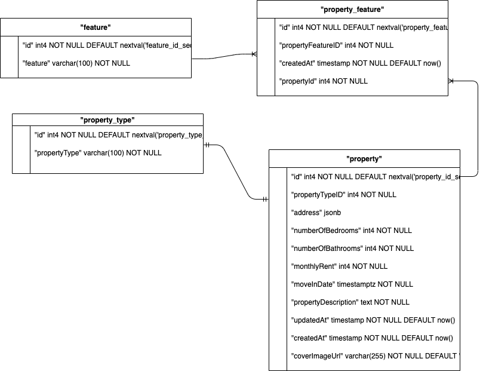

# Property Listing API
This is a small app that allows a user to create, edit and list property. 
This is written in [Node.js](https://nodejs.org/en/) and uses Postgres as databases and [GraphQL](https://www.apollographql.com/docs/)

# How to use

### 1. Install Dependencies
```
npm install
```

### 2. Install Docker and start the DB
Click here to install Docker if not installed already https://docs.docker.com/engine/install/

Run this after docker install to start DB
```
docker-compose up -d 
```

### 5. Run API server
```
npm start
```

The server should be running on ```http://localhost:4000/``` and graphql on ```http://localhost:4000/graphql```
This will also migrate DB and create all tables

# Testing

### 1. Start test DB
``` npm run start-test-db```

### 2. Test 
```npm test```

### 3. Stop test DB( Ideally this should stop after running test automatically)
```npm run stop-test-db```


# GraphQL schema and type

```
type Address {
  addressLine1: String!
  addressLine2: String!
  flatNumber: String!
}

input AddressInput {
  addressLine1: String!
  addressLine2: String = null
  flatNumber: String!
}
type Feature {
  feature: String!
  id: ID!
}

type Mutation {
  propertyCreate(data: PropertyInputType!): Property!

  propertyUpdate(data: PropertyInputType!): Property!
}

type Property {
  address: Address!
  coverImageUrl: String!
  createdAt: DateTime!
  id: ID!
  monthlyRent: Int!
  moveInDate: String!
  numberOfBathrooms: Int!
  numberOfBedrooms: Int!
  propertyDescription: String!
  propertyFeature: [PropertyFeature!]!
  propertyTypeID: Int!
  updatedAt: String!
}

type PropertyFeature {
  createdAt: DateTime!
  id: ID!
  propertyFeatureID: Int!
  propertyId: Int!
}

input PropertyFeatureInput {
  feature: String
  id: ID!
}

input PropertyInputType {
  address: AddressInput!
  id: Int
  monthlyRent: Int!
  moveInDate: DateTime!
  numberOfBathrooms: Int!
  numberOfBedrooms: Int!
  propertyDescription: String!
  propertyFeatures: [PropertyFeatureInput!]!
  propertyTypeID: Int = null
}

type PropertyType {
  id: ID!
  propertyType: String!
}

type Query {
  features: [Feature!]!
  properties: [Property!]!
  property(id: Float!): [Property!]!
  propertyTypes: [PropertyType!]!
}

```

# DB Diagram

